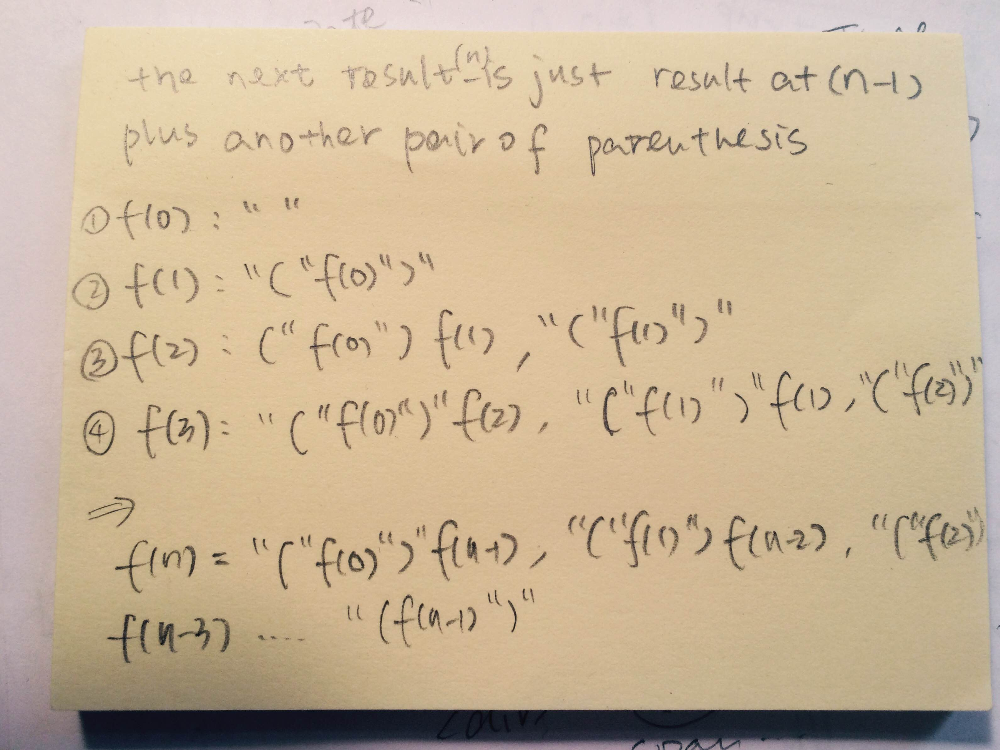

Arrays and Strings
==================

[Wiggle Sort I](../../Sum/Array/wigglesortone.js)

1. if index is odd, ``nums[i]>=nums[i-1]``
2. if index is even, ``nums[i]<=nums[i-1]``
*Odd even will not disturb each other, since it is always swapped with a smaller/larger one*

---
[Majority Element Problem](../../Sum/Array/majorityelement2.js)

the general Voting Algorithm ....

---
**Starting from the Back**

Usually used in cases where updating the previous element affect the result of later element, or when the place is limited 

1. [Pascal Triangle 2](../../Sum/Array/pascaltriangle2.js)

   for example: 1 2 1 --> 1 3 3 1, when we update from front, for 3 at index 1, we update to 3 but still needs the original 2
   
2. [Merge Two Sorted Arrays](../../Sum/Array/mergesortedarray.js)
3. [Replace whitespace with %20](replacespacewith%20.js)

----------------------
## **Binary Search**
1. [Find Minimum Rotate Array](../../Sum/Array/findminrotatearr.js)
2. [Find Peak Element](../../Sum/Array/findpeakelement.js)
3. [Minimum Size Subarray Sum](../../Sum/Array/minimumsizesubarraysum.js)
   
   Method 1 could be using a slide window (you can use two pointer to keep the index), the time complexity could be O(N)
   
   Method 2 is to compute the pre-sum of the array first then use binary search to find the target. Although this one is time    O(NlgN)
4. [Search a 2D Matrix](../../Sum/Array/search2dmatrix.js)
5. [Search for a Range](../../Sum/Array/searchforrange.js): *binary saerch with two pointers, for nums[mid]===target condition, be careful about the index*
  
  1) map index of 2d matrix to a 1d array, in order to perform binary search
  
  2) there are drawbacks of the methods: index may overflow while we mapping it
5. [Search Insert Position](../../Sum/Array/searchinsertpos.js): *binary search used for insertion*

We could move low position, there is no specific need to determine the position as to check mid+1 when mid is smaller than target, we can check the number at last. 

---
## **Dynamic Programming**

### **Dynamic Programming dealing with Product that can be both Positve and Negative** 
1. [Maximum Product Subarray](../../Sum/Array/maxproductsubarr.js)
2. [Maximum Subarray](../../Sum/Array/maximumsubarray.js): *if negative, start from 0 again*

### **Dynamic Programming start from bottom up**
1. [Triangle](../../Sum/Array/triangle.js)

### **Dynamic Programming dealing with matrix path sum**
1. [Minimum Path Sum](../../Sum/Array/minimumpathsum.js)

### **Dynamic Programming for traverse matrix with obstacle**
1. [Unique Path II](../../Sum/Array/uniquepath2.js)
  
set the obstacle place to zero 

---
## **Greedy method** 
1. [Best Time to Buy and Sell Stock II](../../Sum/Array/besttimebutsellstock2.js)

---
## **Maximum place that can be reached** 
1. [Jump Game](../../Sum/Array/jumpgame.js)
2. Buying and Selling Stock Problem 

---
## **Permuting Elements**
1. [element permuting I](../../Sum/Array/permelements.js): *a general way to permute elements*
2. [element permuting II](../../Sum/Array/permuelement2.js): *permute elements with specific requirements* 

### General Step: 
1. Find way to map oldIdx to newIdx in new array 
2. Iterate through old array, put the correct number on each place
3. Mark the place in some way, as we traverse 

---
## **Sum and Backtrack**
1. [4Sum](../../Sum/Array/4sum.js)
2. [3Sum](../../Sum/Array/3sum.js)
3. [3Sum Closest](../../Sum/Array/3sumclosest.js)

---

### [Remove Duplicates from Sorted Array II](../../Sum/Array/removedupsorted2.js)

  *check every two items*

### [Word Search](../../Sum/Array/wordsearch.js) 

  *explore*

### [Sort Colors](../../Sum/Array/sortcolors.js) 

  *use swap(more implementation needed)*

### [Spiral Matrix I](../../Sum/Array/spiralmatrix.js) and [Spiral Matrix II](../../Sum/Array/spiralmatrix2.js) 

  *keep four index to track the boundary*
  
### [Container with maximum water](../../Sum/Array/containerwithmostwater.js)

*Observe how analytics*

### [ZigZag Conversion](../../Sum/String/zigzagconverstion.js)

*identify loops*

### [Longest Common Prefix](../../Sum/String/longestcommonprefix.js)

*don't forget to take the smaller one between prefix and current string that been compared *

### [Compare Version Numbers](../../Sum/String/compareversion.js)

### [Valid Palindrome](../../Sum/String/validpalindrome.js)

*use regular expression to match multiple white space*

### Count and Say

*there are only 1, 2 and 3 numbers that are possible*

### Reverse a Word in String

*when reverse number, need to consider the leading and trailing zeroes*

### [Letter Combination of a Phone Number](../../Sum/String/lettercombinationofphonenumber.js)

*from data structure perspective to reduce time complexity*

### [Basic Calculator](../../Sum/String/basiccalculator.js)

*transform negative value to positive value,*

### [Restore IP Address](../../Sum/String/restoreipaddress.js)

*be careful about the valid number, prefix 0 is not a valid number *

### [Generate Parenthese](../../Sum/String/generateparenthese.js)

*detect boundary case / dynamic programming*

### Longest Palindromic Substring

*when a string is a Palindrome, it will be have a symmetric structure, so you can start from the center, understand the meaning of longest*

