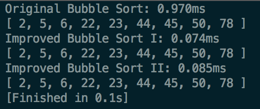

# Basic Sorting Algorithm in Javascript 

## 1. Bubble Sort

### General Step:

1) Compare adjacent elements in array, if `arr[i] > arr[i+1]` then swap them, after this, the last item is the largest element in current unsorted elements 

2) to all elements repeat step 1, except the last element 

3) repeat the process until all elements are sorted 

### Improved I:

we can keep a record of last swapped position, since after the last swap, all elements behind the position are sorted already, we did not need to traverse those elements again. 

### Improved II:

we can use 2 pointer, one start swap from the start and another one start swap from end, so that the element we need to swap 

[Javascipt Bubble](./bubblesort.js)

    

>  Bubble sort is a in-place sorting method, Time complexity is O(n^2) 

## Selection Sort

travel through the array and find the smallest/largest in unsorted part, and swap with the next sorted position

[Javascript Selection Sort](./selectionsort.js)

> Time Complexity is O(n^2), in-place

## Insertion Sort

travel through the array, assume first element is already sorted, insert the second element, if the second element is smaller than the sorted element, shift the sorted element back. repeat the process until we reach the end of array

[Javascript Insertion Sort](./insertionsort.js)

### Improved Insertion Sort I 

when insert new element, use binary search to improve 

## Shell Sort 

For different gaps, perform insertion sort for subarrays with gaps, the last gap needs to be 1. 

[Javascript Shell Sort](./shellsort.js) 

> Time Complexity O(nlgn), in-place sort 

## Merge Sort 

A typical Divide and Conquer Approach 

[Javascript Merge Sort](./mergesort.js)

> Time complexity analysis: best case O(N) already sorted, worst case:  

## Quick Sort

decide a pivot each time and divide the array into two parts by the pivot, until each part is been sorted 

[Javascript Quick Sort](./quicksort.js)

> Time Complexity: best case, average case are O(nlogn) and worst case is O(n^2), when every time you choose a extreme value for unsorted part 

## Heap Sort

[Quick Review of Heap Concept](https://www.cs.cmu.edu/~adamchik/15-121/lectures/Binary%20Heaps/heaps.html)

[Heap Sort Wiki](https://en.wikipedia.org/wiki/Heapsort)

Use heap data structure's property, a heap can be represented use an array, with parent(i), left child(2*i+1) and right child(2*i+2).

1. Build a max heap, insert element to the last element of already built heap, bubble up (swap with parents) if the heap property is been violated. 

2. Heapify (heapsort): From step 1, we already have a max heap. Then each time we swap top of the heap with the bottom element, bubble down the current top with its larger child to meantain heap property, after the new top is set, we remove the last element and put it into our sorted result. Each time we have a last element in remain heap as ordered element, this element is not considered when comparing element. 

> Time Complexity: average case, best case and worst case are O(nlgn) 

[Javascript HeapSort](./heapsort.js)

## Counting Sort 

Counting sort can only be used to sort integers, and those integers must have a valid range. 

It will need an additional array to keep numbers counts

1. Find minimum and maximum number in the unsorted array 
2. scan array again and build the count array
3. scan the count array then calculate the aggregate count so far 
4. starting from back, scan the array and put them inorder 

> Time Complexity: since we need to scan whole array and the counts array, the whole process will take O(n+k) time complexity 

[Javascript Counting Sort](./countingsort.js) 

## Bucket Sort 

Counting sort is a upgraded version of counting sort, it seperate unsorted elements into several buckets. For each bucket, we sort inside the bucket. Then concat sorted buckets that are not empty

bucket sort needs extra space, the time complexity depends on the sorting method in each bucket, other parts for the sort takes O(n). 

If the bucket size is smaller, sorting time for each group will decrease, but we will have to increase bucket space usage. 

[Javascript Bucket Sort](./bucketsort.js) 

## Radix Sort

Radix sort is also using different buckets, the bucket is for digits. 

[Javascript Radix Sort](./radixsort.js)

> Time Complexity: best, average, worst case O(n*k), n is the number of elements we would like to sort and k is the maximum Digits 

