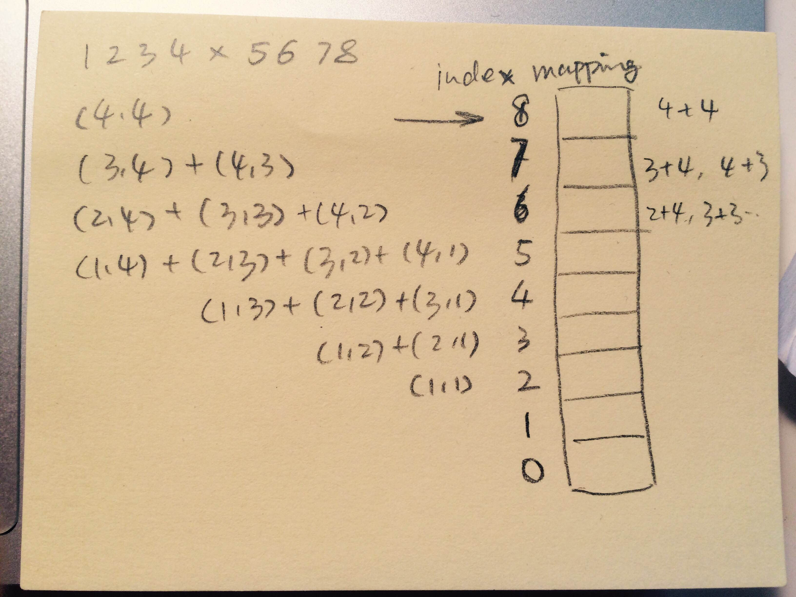

<<<<<<< HEAD
=======
Math
====

## Some common issues to take into consideration in dealing with those problems 

1. Overflow/Underflow
2. Positive number/Negative Number
3. Power(x, n), negative cases for power index 

## Recursive power problems 

### Power of Two

### [Power(x, n)](./powxn.js)
be careful about the negative cases.

---
## Binary search
 
### [Square Root](./sqrtx.js)

we can perform the binary search from top down or from bottom up. When considering these two method, we should take overflow into consideration, since two number multiply. 

---
## Factors problem

### Factorial Trailing Zeroes 

The trailing zeroes depends on the number of 10s in the decomposition of the number. However, 10 depends on 2 and 5, and depends on the less number of 2 or 5. The number of 5 factors is less than the number of 2 factors. So in this case we can only consider the number of 5 factor.

### Add digits

```
  we know:
  1%9 = 1;
  10%9 = 1;
  100%9 = 1;
  ... more the same 

  (an*10^n + a(n-1)*10^(n-1) + ... + a2*100 + a1*10 + a0)%9 = (an + a(n-1) + a(n-2) + ... + a2 + a1 + a0);
```

### Bulb Switcher

the final status of the bulb depends on the number of divisors, all of them will be even, since number = a*b, except that 
when there is a power, then it will be odd. So just count the number of square number here.

--- 

## Dynamic Programming 

### [Integer Break](./integerbreak.js)


### [Ugly Number II](./uglynumber2.js)

dynamically change the index 

### [Perfect Square](./perfectsquare.js)

dynamic programming, for each number, find the mimimun number of sum. 

from previous numbers, since the minimum number can only have square sums that is less than itself 

`n = some perfectsquare(1) + dp[n-somefectsquare]`. 

---

## Index mapping

### [Multiply Strings](./multiplystrings.js)



---

### [Reverse Integer](./reverseinteger.js)

**Be careful about the overflow cases**

### [Permutation Sequence](./permutationsequence.js)

1. method 1, we could use the same method for compute next permutation and do it for k times
2. method 2, we can calculate the places 
>>>>>>> 45d4c6e70b884341fab3279cc02d231e6e85f4e8
